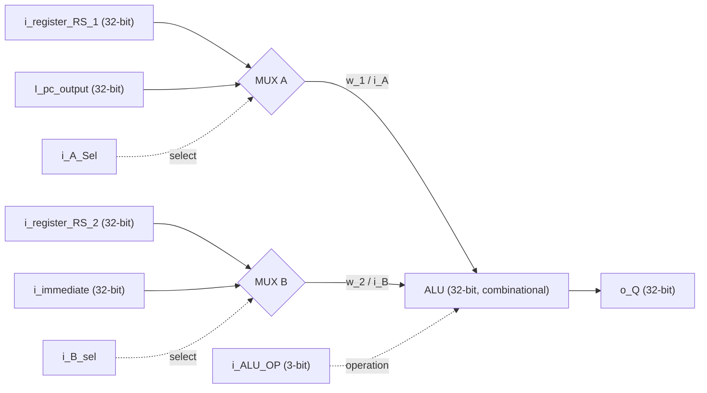

# 32-bit RISC-V ALU Datapath

A small **combinational 32-bit ALU datapath** written in Verilog. The design consists of two 2-to-1 operand multiplexers and an ALU. The multiplexers choose register, immediate, or PC inputs; the ALU performs five arithmetic/bitwise operations. This is a **datapath building block**, not a complete RISC-V CPU or a complete RV32I ALU.

> **Origin:** The supplied RTL contains a ChipInventor Cloud EDA Tool 3.15 generated-code header. The RTL in `rtl/riscv_alu.v` preserves the supplied design, including its module names and port spellings.

## Block diagram



## RTL modules

| Module | Function |
| --- | --- |
| `MUX2_32` | Selects `A` when `S=0`, or `B` when `S=1`. |
| `ALU` | Computes an operation on two signed 32-bit inputs; produces a signed 32-bit result. |
| `top` | Connects two operand multiplexers to the ALU; top-level module for this project. |

## Top-level interface

| Port | Direction | Width | Description |
| --- | --- | ---: | --- |
| `i_ALU_OP` | Input | 3 | ALU operation selector. |
| `i_register_RS_1` | Input | 32 | Register-file source operand 1. |
| `i_register_RS_2` | Input | 32 | Register-file source operand 2. |
| `I_pc_output` | Input | 32 | PC value (capital `I` in supplied RTL). |
| `i_immediate` | Input | 32 | Immediate operand; assumed already generated/extended upstream. |
| `i_B_sel` | Input | 1 | `0`: RS2; `1`: immediate. |
| `i_A_Sel` | Input | 1 | `0`: RS1; `1`: PC. |
| `o_Q` | Output | 32 | Combinational ALU result. |

The operand routing is:

```verilog
w_1 = i_A_Sel ? I_pc_output : i_register_RS_1;
w_2 = i_B_sel ? i_immediate : i_register_RS_2;
```

## ALU operation encoding

| `i_ALU_OP` | Operation | Expression |
| --- | --- | --- |
| `3'b000` | ADD | `i_A + i_B` |
| `3'b001` | SUB | `i_A - i_B` |
| `3'b010` | AND | `i_A & i_B` |
| `3'b011` | OR | `i_A \| i_B` |
| `3'b100` | XOR | `i_A ^ i_B` |
| `3'b101`, `110`, `111` | **Default: ADD** | `i_A + i_B` |

**Important:** Codes `101`–`111` are *not* shift, comparison, or multiply operations in this RTL; the `default` branch adds. The 32-bit output retains only the low 32 bits on arithmetic overflow. There are no overflow, carry, or comparison flags.

## Combinational vs. multicycle

This module has **no clock, reset, pipeline registers, or FSM**. An input or selector change propagates to `o_Q` after combinational delay. In a multicycle RISC-V CPU, the *surrounding control unit* can select operands during an execute cycle and capture the ALU result in a clocked register at the cycle boundary. The ALU itself does not take multiple clock cycles or implement CPU instruction sequencing.

## Repository structure

```text
riscv-alu/
├── README.md
├── rtl/
│   └── riscv_alu.v          # Original supplied RTL: MUX2_32, ALU, top
├── tb/
│   └── tb_top.v             # Self-checking simulation testbench
├── Makefile                 # Optional Icarus Verilog commands
└── .gitignore
```

## Simulation and verification

Install [Icarus Verilog](https://steveicarus.github.io/iverilog/) (`iverilog` and `vvp`) and run from the repository root:

```bash
make test
```

Or run directly:

```bash
iverilog -g2012 -s tb_top -o simv rtl/riscv_alu.v tb/tb_top.v
vvp simv
```

The self-checking testbench exercises all five defined operations, default ADD encodings, all four combinations of the two operand-select signals, and signed/overflow-oriented examples. It prints `PASS` when all checks match. This README does not claim synthesis, timing closure, or hardware validation.

## Example datapath usage

For an instruction that needs `RS1 + immediate`, drive `i_A_Sel=0`, `i_B_sel=1`, `i_ALU_OP=3'b000`. The result is `RS1 + immediate`. For a PC-relative addition, set `i_A_Sel=1` and `i_B_sel=1` with ADD. Instruction decoding, immediate generation, register write-back, and PC update must be implemented elsewhere.

## Current limitations and possible extensions

The design does **not** implement the full RV32I operation set: shifts (`SLL`, `SRL`, `SRA`), signed/unsigned comparisons (`SLT`, `SLTU`), and branch decision logic are absent. Multiply/divide operations from the optional M extension are also absent. To integrate into a CPU, define the control encoding consistently with the decoder and add clocked registers/control around the datapath as needed. The file's autogenerated warning also means regenerating code in the original design tool may overwrite local edits.
